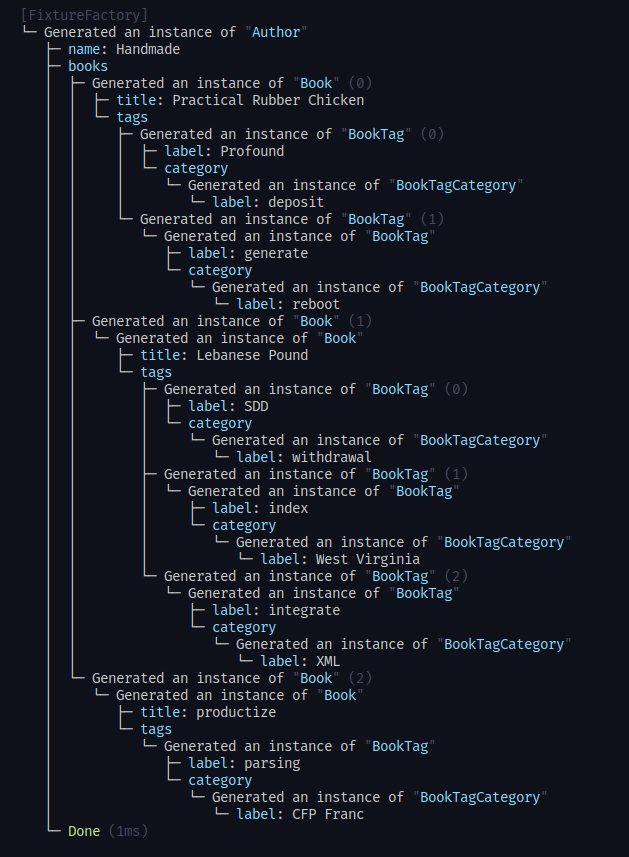

# class-fixtures-factory <!-- omit in toc -->

This lightweight lib is a class factory to generate fixtures on the fly. However, contrarily to most (or rather all)
libs out there, `class-fixtures-factory` generate fixtures from classes. This is handy when you already have
classes as your source of truth and do not want to write custom schema to generate fixtures.  
Also, because the lib is based on emitted TypeScript's metadata, if you heavily
use decorators in your classes (when working with `class-validator`, `type-graphql`, for example), the setup will be even easier.

If you aren't familiar about what fixtures are, they are simply randomly generated data and are often used for database
seeding or for testing.

- [Features](#features)
- [Usage](#usage)
  - [General](#general)
  - [Customization](#customization)
  - [Factory Options](#factory-options)
    - [Assigner](#assigner)
  - [API](#api)

## Features

- Generate fixtures on the fly at runtime
- Leverage `faker.js` for generating random values
- Support relationships between classes
- Customizable
- Support `class-validator@0.11.x` decorators. (`type-graphql` to come at a latter date)  
  **Version 0.12.x is broken and doesn't store the decorator names, so it's impossible for this lib to work alongside.**

## Usage

### General

Because `class-fixtures-factory` relies on metadata, you'll have to:

1. Register all the classes you're going to use
2. Annotate properties with decorators
   Besides the decorators shipped with the lib, you can also use `class-validator` decorators.

```ts
import { FixtureFactory } from 'class-fixtures-factory';

const factory = new FixtureFactory();
factory.register([Author, Address, Book]);

// Generate a fixture
let author = factory.make(Author).one();
// Generate multiple fixtures
let authors = factory.make(Author).many(10);

// Ignore some properties at runtime
const partialAuthor = factory
  .make(Author)
  .ignore('address', 'age')
  .one(); // address and age are undefined

// Override properties at runtime
const agedAuthor = factory
  .make(Author)
  .with({
    age: 70,
    address: specialAddr, // any actual address entity object
  })
  .one();
```

### Customization

As stated previously, you'll need to annotate your class properties somehow, because types metadata
are used for generating fixtures.
The lib exposes a `Fixture` decorator for that purpose and for further customization.
If your properties are already annotated with decorators from `class-validator`, there's no need to use `Fixture`, mostly. 
However, there are some cases where the `Fixture` decorator is **mandatory**;

- If the type is an array
- If the type is an enum

```ts
class Author {
  // decorator from class-validator
  // no need to use Fixture
  @Length(5, 10)
  name: string;

  @Fixture()
  age: number;

  @Fixture({ type: () => [Book] })
  books: Book[];

  @Fixture({ enum: Mood })
  mood: Mood = Mood.HAPPY;
}
```

Futhermore, `Fixture` can be used for further customization, using [faker.js](https://github.com/marak/Faker.js/#api), as stated:

```ts
export class Author extends BaseEntity {

  @Fixture(faker => faker.name.firstName())
  firstName: string;

  @Fixture('{{name.lastName}}')
  lastName: string;

  @Fixture(() => 24)
  age: number;

  @Enum()
  mood: Mood;

  @Fixture({ type: () => [Book] }, { min: 3, max: 5 })
  books: Book[];

  // same as not using @Fixture at all
  @Fixture({ ignore: true })
  address: Address;
}
```

### Factory Options

You can pass an `options` object to the `FixtureFactory` constructor:

```ts
import { FixtureFactory } from 'class-fixtures-factory';

const factory = new FixtureFactory({ /* options */});
```

The `options` parameter can take:
* `debug` (boolean)
  Whether to print generated objects or no.
  


#### Assigner

You can provide a function to define how values are assigned to generated objects.
```ts
const assigner: Assigner = (prop, obj, value) => {
  // default behavior
  obj[prop.name] = value;
}
factory.setAssigner(assigner);
```

### API

See the API docs page [here](./docs/markdown/index.md).
